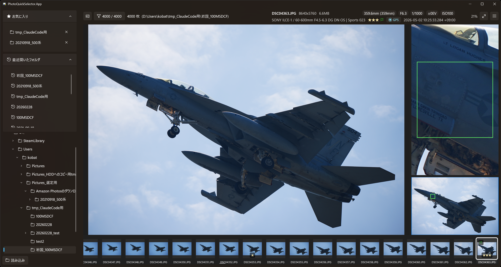
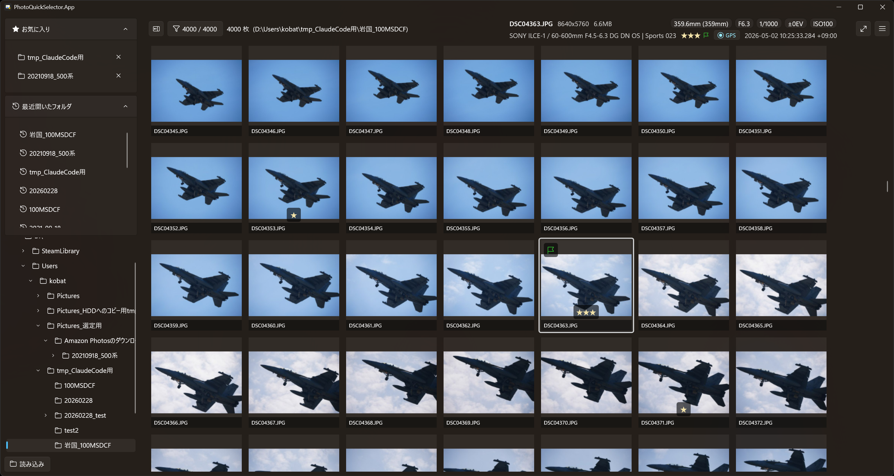

# PhotoQuickSelector

[English](README.en.md)

写真を高速に閲覧・選別する Windows デスクトップアプリです。
ローカルフォルダ内の写真をキーボード中心の操作でテンポよく確認し、レーティング・フラグ・カラーラベルを付けて選別できます。評価は元ファイルを書き換えず、フォルダごとの SQLite に保存します。



<!-- ↑ サンプルのスクリーンショットです。差し替え・追加は docs/images/ 配下の画像と、この参照を編集してください。 -->

## 特長

- **左右分割の単一画面** — 左＝フォルダツリー（お気に入り／最近開いたフォルダ）、右＝閲覧（サムネイルグリッド ⇄ 大画面プレビュー）。
- **数千枚でも快適** — メタデータの並列読込、サムネイル・ピクセルデータの先読みキャッシュ。
- **元ファイルを汚さない評価** — レーティング（0–5）・採用/拒否フラグ・カラーラベル（5 色）をフォルダごとの `PhotoQuickSelector.sqlite3` に保存。
- **本格的なプレビュー** — ズーム／パン／ルーペ（100% 精査）／ナビゲーター、EXIF・AF 枠・構図グリッドの表示。
- **選別を仕上げるフィルタと出力** — 条件フィルタ＋ファイル名一覧コピー、未評価の Reject フォルダ移動、リネームしてコピー。
- **キーボード中心の高速操作** — 評価・移動・ズーム・複数選択・一括評価をショートカットで（`F1` で一覧表示）。
- **インストール不要** — .NET / Windows App SDK ランタイムを同梱した自己完結 EXE。
- **日本語 / 英語 UI** — 既定で OS の表示言語に追従。設定ダイアログで切替可（再起動後に反映）。

## 動作環境

- Windows 10 / 11（x64）
- ランタイム同梱のため、.NET や Windows App SDK の事前インストールは不要です。

## インストール／起動

1. [Releases](https://github.com/kobat/PhotoQuickSelector-rebuild/releases) から最新の EXE をダウンロードします。
2. ダウンロードした EXE を実行します。

> **メモ:** 署名なし配布のため、初回起動時に Windows SmartScreen の警告が出る場合があります。
> その場合は「詳細情報」→「実行」で起動できます。

## 使い方（クイックスタート）

1. **フォルダを開く** — 左ペインのツリーでフォルダを選んで「読み込み」ボタン（ダブルクリックはツリーの展開/折りたたみ）。お気に入り・最近開いたフォルダはクリックだけで読み込めます。
   - よく使うフォルダはツリーのノードを右クリックで **お気に入り** に登録できます。
2. **評価する** — サムネイルを選び、`0`–`5`（レーティング）／`6`–`9`・`P`（カラーラベル）／`Ctrl+↑`・`Ctrl+↓`（採用/拒否フラグ）。
   - 評価は自動でそのフォルダの SQLite に保存されます（フォルダで最初の評価時に作成確認あり）。
3. **じっくり見る** — サムネイルをダブルクリックで大画面プレビューへ。`←`／`→` で前後、`Z` でズーム、ホイールや `+`／`-` で段ズーム。
4. **絞り込む** — `Ctrl+L` でフィルタを ON/OFF。レーティング・フラグ・カラーで絞り込み。
5. **書き出す** — フィルタ結果のファイル名一覧コピー、未評価の Reject フォルダ移動、リネームしてコピー、など。



## ショートカット

主要な操作だけ抜粋します。**全ショートカットはアプリ内で `F1`**、または一覧ドキュメント **[docs/SHORTCUTS.md](docs/SHORTCUTS.md)** を参照してください。

| キー | 説明 |
|---|---|
| `0` – `5` | レーティング |
| `6` / `7` / `8` / `9` / `P` | カラーラベル（赤 / 黄 / 緑 / 青 / 紫） |
| `Ctrl+↑` / `Ctrl+↓` | 採用 / 拒否フラグ |
| `←` / `→` | 前後の写真へ移動 |
| `Z` / `Shift+Z` | ズーム切替 / 等倍 100% |
| `Ctrl+L` | フィルタ ON/OFF |
| `F11` / `Shift+F` | 全画面 / 完全全画面 |
| `F1` | ショートカット一覧を表示 |

> ショートカット一覧の元データは [`shortcuts.json`](shortcuts.json) です（アプリ内 `F1` 表示と `docs/SHORTCUTS.md` の共通の情報源）。

## ビルド（開発者向け）

- 前提: .NET SDK（`net10.0-windows` をビルドできるもの）、Windows App SDK、Developer Mode 有効。
- 実行:
  ```powershell
  cd src\PhotoQuickSelector.App
  dotnet run
  ```
- テスト:
  ```powershell
  dotnet test
  ```
- 配布用の発行（自己完結・単一ファイル）:
  ```powershell
  dotnet publish src\PhotoQuickSelector.App -c Release -p:Platform=x64 -p:PublishProfile=win-x64-singlefile
  ```

開発環境の詳細や設計メモは [CLAUDE.md](CLAUDE.md)、仕様は [SPEC.md](SPEC.md) を参照してください。

## ライセンス

本アプリは [MIT License](LICENSE)（Copyright © 2026 KOBAT）で配布します。
同梱する第三者ライブラリの許諾は [THIRD-PARTY-NOTICES.txt](THIRD-PARTY-NOTICES.txt) を参照してください。
